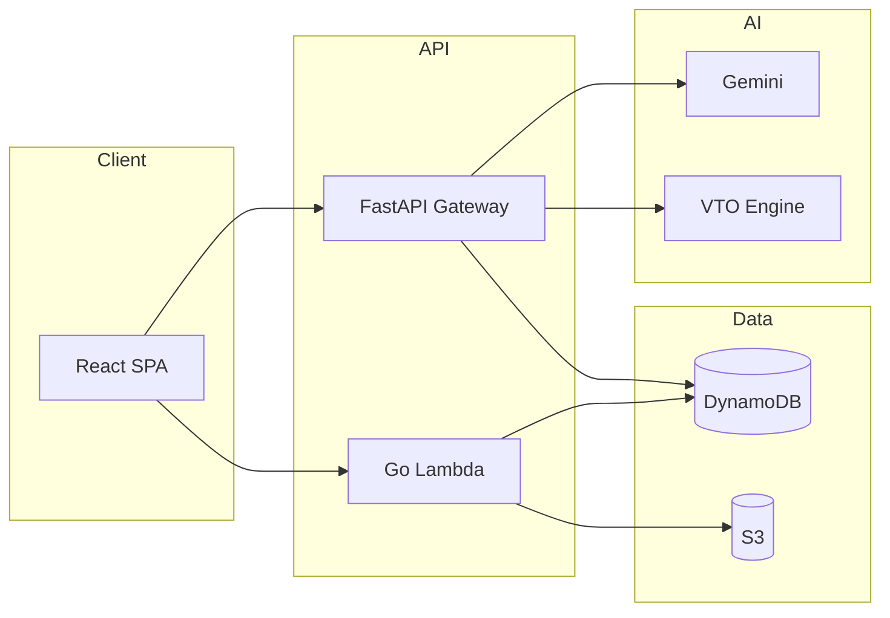

# SecondLife Commerce

**Circular Commerce & Return Interception Platform** — Amazon Hackathon Finals

> Transform retail returns from a carbon-heavy warehouse round-trip into a hyperlocal, AI-routed circular economy.

---

## Executive Summary

### Problem
Retail returns cost billions annually and generate massive Scope-3 CO₂ emissions. Buyers bracket sizes, sellers lose margin, and platforms bear fraud risk — all while every return ships hundreds of kilometers to a central warehouse.

### Solution
SecondLife Commerce intercepts returns **at the point of decision** using:
- **Predictive friction** to stop bad purchases before checkout
- **Virtual try-on** to eliminate fit uncertainty
- **AI triage** to grade condition in seconds
- **Hyperlocal P2P matching** to reroute goods to nearby buyers
- **Graph fraud detection** to protect the ecosystem

### Impact
- Up to **68% reduction** in reverse-logistics cost
- **2.4 kg CO₂ saved** per warehouse return avoided
- Real-time seller dashboards for carbon and capital recovery

---

## Key Features

### Buyer
- Product catalog with GS1 verification
- Dynamic pricing & demand signals
- Return-risk cart analysis
- Virtual try-on (photo upload → garment overlay)
- Return wizard with AI condition scan
- CO₂ savings dashboard

### Seller
- AI-assisted listing creation
- Escrow lock/release state machine
- Shipment tracking & delivery overview
- Trust score monitoring
- Sustainability metrics (CO₂, trees, warehouse avoidance)

### Admin
- Fraud investigation (GraphRAG + trust scores)
- Serial/package verification
- Fleet telemetry & route optimization (NSGA-II + GA)
- Unit-level inventory management
- Operations workspace

### AI Components
| Component | Technology |
|-----------|------------|
| Condition grading | Google Gemini multimodal |
| Return disposition | Gemini agent + rule engine |
| Friction prediction | XGBoost + DynamoDB history |
| Fraud trust score | Graph features on returns network |
| VTO | IDM-VTON / local overlay pipeline |
| Route optimization | NSGA-II multi-objective |
| Fleet planning | Genetic algorithm (cost + emissions) |

---

## Architecture



See [docs/architecture.md](docs/architecture.md) for full design.

---

## Tech Stack

| Layer | Technology |
|-------|------------|
| Frontend | React 18, TypeScript, Vite |
| API Gateway | Python FastAPI, Go AWS Lambda |
| Database | Amazon DynamoDB, Redis cache |
| ML/AI | Gemini, XGBoost, scikit-learn, PyTorch, IDM-VTON |
| Infrastructure | Docker, AWS SAM, CodeBuild, ECR |
| Real-time | Socket.IO / API Gateway WebSocket |

---

## Repository Structure

```
├── frontend/                 # React SPA (buyer + seller + admin)
├── backend/ml-service/       # FastAPI API gateway
├── backend/serverless-api/   # Go return-intercept Lambda
├── packages/shared-types/    # TypeScript API contracts
├── services/                 # Logical microservice map
├── database/seeds/           # DynamoDB bootstrap
├── infrastructure/           # Docker Compose
├── docs/                     # Canonical documentation
└── tests/                    # unit / integration / e2e / performance
```

---

## Local Setup

```bash
# 1. Clone and configure
git clone https://github.com/kavyarathod05/CircularCommerce.git
cd CircularCommerce
cp .env.example .env
cp frontend/.env.example frontend/.env

# 2. Start stack
docker compose -f infrastructure/docker-compose.yml up --build
# OR
./run_backend.bat && ./run_frontend.bat

# 3. Seed data (requires AWS credentials)
python database/seeds/setup_aws.py
python database/seeds/seed_dynamodb.py

# 4. Open http://localhost:5173
# Demo login: buyer@demo.com / buyer123
```

Add `GEMINI_API_KEY` to `.env` for full AI features.

---

## Deployment

- **Backend container:** `buildspec.yml` → ECR → Lambda/ECS
- **Go serverless:** `cd backend/serverless-api && sam deploy`
- **Frontend:** `cd frontend && npm run build` → S3 + CloudFront

Details: [docs/deployment.md](docs/deployment.md)

---

## Security

- JWT authentication with production secret enforcement
- RBAC: buyer / seller / admin
- Secrets via `.env` (never committed)
- Input validation on all API endpoints

Details: [docs/security.md](docs/security.md)

---

## Scalability

- Stateless API → horizontal scaling behind ALB
- DynamoDB on-demand → auto-scales with traffic
- Redis catalog cache (3600s TTL)
- VTO extractable to GPU ECS + SQS queue

Details: [docs/aws-review.md](docs/aws-review.md)

---

## Sustainability Impact

Every hyperlocal match avoids a warehouse round-trip (~2.4 kg CO₂). Metrics computed from DynamoDB return pathways and surfaced on seller/buyer dashboards.

Details: [docs/impact.md](docs/impact.md)

---

## Documentation

| Document | Description |
|----------|-------------|
| [architecture.md](docs/architecture.md) | System design |
| [api.md](docs/api.md) | Endpoint reference |
| [database.md](docs/database.md) | Schema & indexes |
| [security.md](docs/security.md) | Security model |
| [ml-architecture.md](docs/ml-architecture.md) | AI/ML pipelines |
| [testing.md](docs/testing.md) | Test strategy |
| [deployment.md](docs/deployment.md) | Deploy guide |
| [impact.md](docs/impact.md) | Carbon metrics |
| [troubleshooting.md](docs/troubleshooting.md) | Common issues |

Audit reports: [docs/reports/](docs/reports/)

---

## Future Roadmap

1. **Auth:** Amazon Cognito + API Gateway authorizer
2. **Schema:** Unified DynamoDB CloudFormation stack
3. **VTO:** GPU-backed ECS with request queue
4. **Observability:** CloudWatch dashboards + X-Ray tracing
5. **Carbon:** Category-specific emission factors + third-party audit API

---

## License

ISC — See repository for details.

**Built for Amazon Hackathon 2026** 🌍♻️
