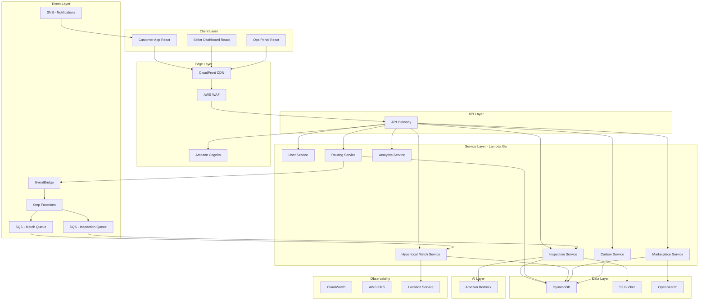
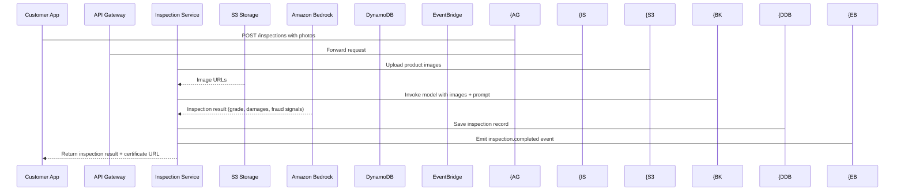
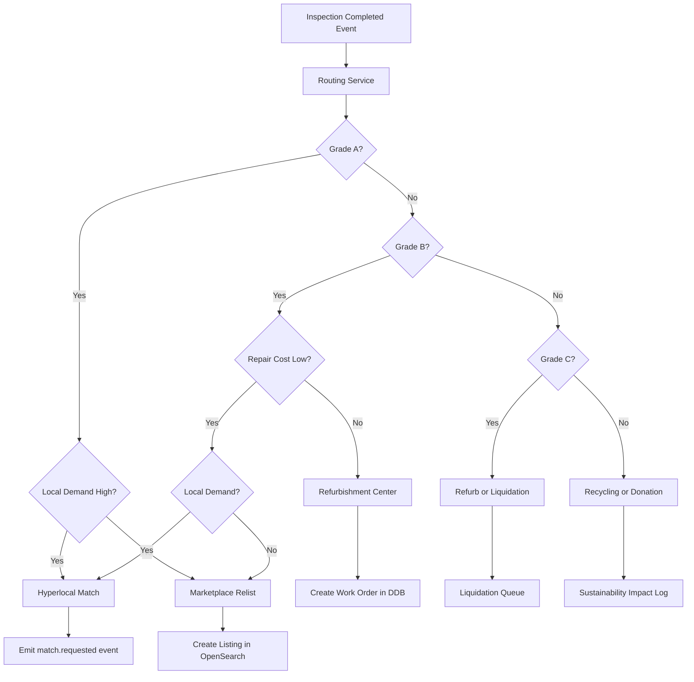
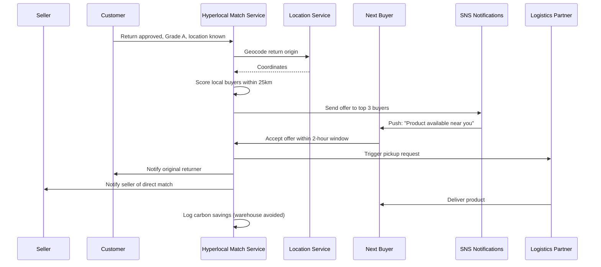
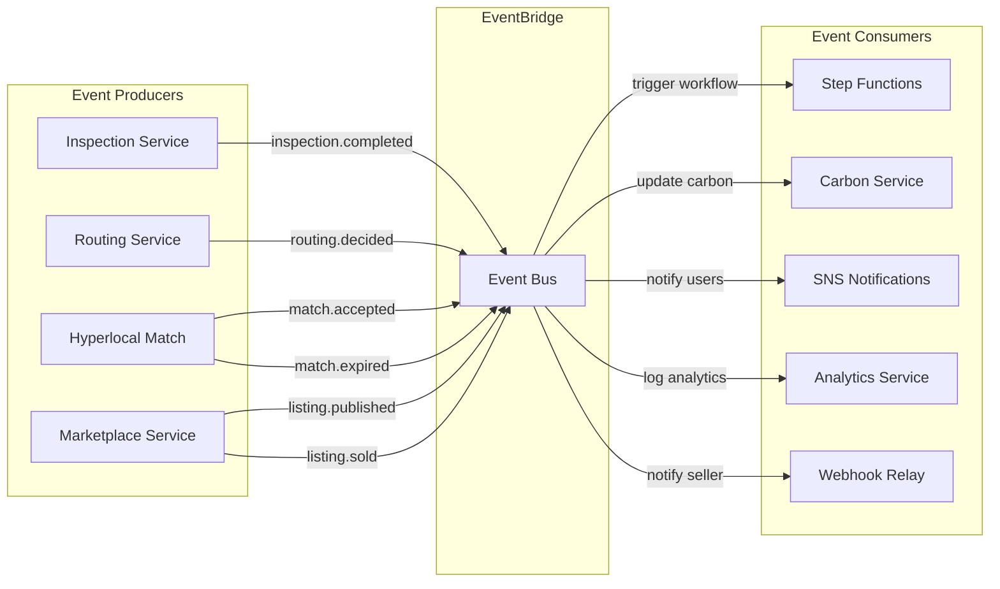
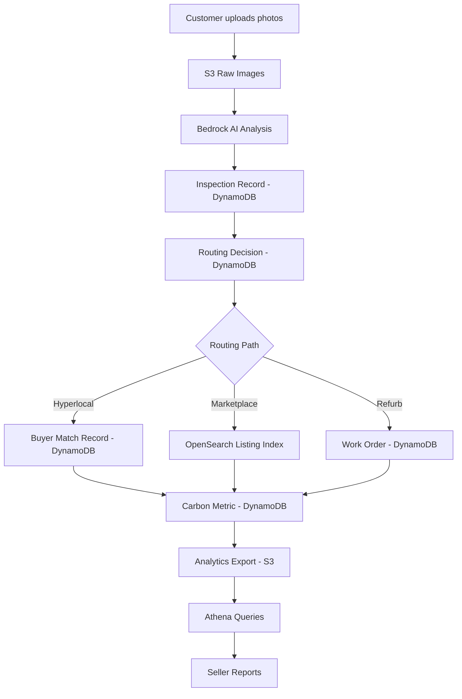

# AWS System Architecture & Diagrams

## 1. Complete AWS Architecture Service Map

The SecondLife Commerce platform is built on an event-driven serverless architecture using Go microservices running on AWS Lambda, storing data in Amazon DynamoDB and Amazon S3, and leveraging Amazon Bedrock for multimodal AI analysis.

| AWS Service | Role in Platform |
|---|---|
| **React + Tailwind (Frontend)** | Customer app, seller dashboard, ops portal |
| **CloudFront** | Global CDN for frontend assets, low-latency delivery |
| **S3** | Product photo storage, AI inspection reports, certificates |
| **Amazon Cognito** | User authentication — customers, sellers, ops users |
| **API Gateway** | REST API entry point, request routing, rate limiting, auth validation |
| **AWS Lambda (Go)** | All backend microservices — inspection, routing, matching, carbon, marketplace |
| **Amazon DynamoDB** | Primary data store — users, returns, inspections, listings, routing decisions |
| **Amazon Bedrock** | AI inspection engine — image analysis, grading, fraud detection, listing generation |
| **Amazon EventBridge** | Event bus — decouples services, drives async workflows |
| **Amazon SQS** | Message queues for inspection jobs, notification delivery |
| **Amazon SNS** | Push notifications — return status updates, buyer match alerts |
| **AWS Step Functions** | Orchestrate multi-step workflows — inspection → routing → matching |
| **Amazon Location Service** | Geocoding, distance calculation for hyperlocal matching |
| **Amazon OpenSearch** | Product search index for second-life marketplace listings |
| **Amazon CloudWatch** | Logging, metrics, alerting, distributed tracing |
| **AWS KMS** | Certificate signing, data encryption |
| **AWS WAF** | Web Application Firewall on API Gateway |
| **Amazon Athena** | Analytics queries on S3-exported DynamoDB data |

---

## 2. Service Interaction Summary

```
Customer App (React)
  → CloudFront
  → API Gateway (with Cognito auth + WAF)
  → Lambda (Go microservices)
  → DynamoDB (primary store)
  → S3 (images, certs)
  → Bedrock (AI inspection)
  → EventBridge (async events)
  → Step Functions (workflow orchestration)
  → SQS / SNS (queuing + notifications)
  → OpenSearch (search)
  → Location Service (geo)
  → CloudWatch (observability)
```

---

## 3. Architecture Diagrams

### 3.1 High-Level Architecture



---

### 3.2 AI Inspection Workflow



---

### 3.3 Smart Routing Workflow



---

### 3.4 Direct-to-Next-Owner Workflow



---

### 3.5 Event-Driven Architecture



---

### 3.6 Data Flow Diagram


