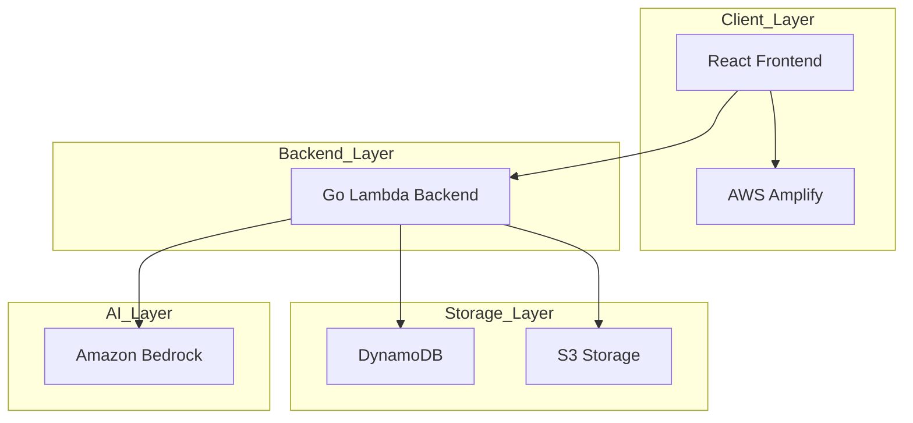
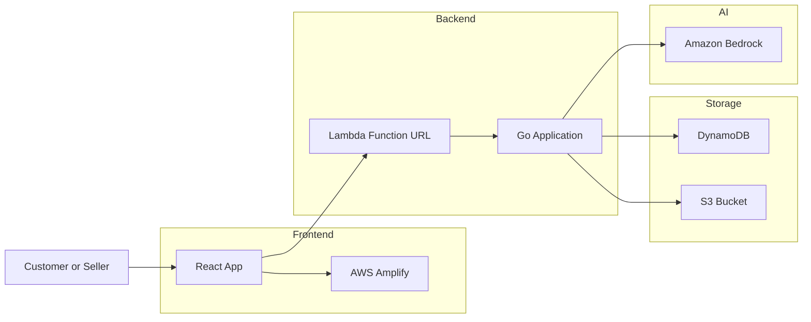
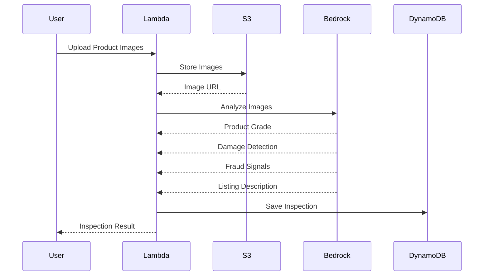
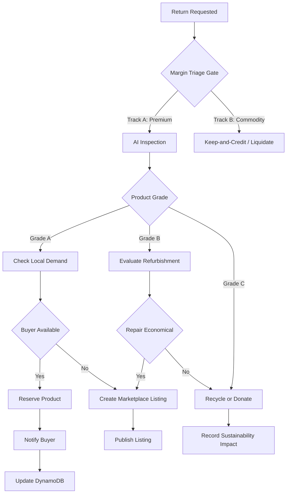
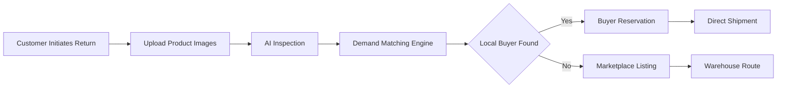
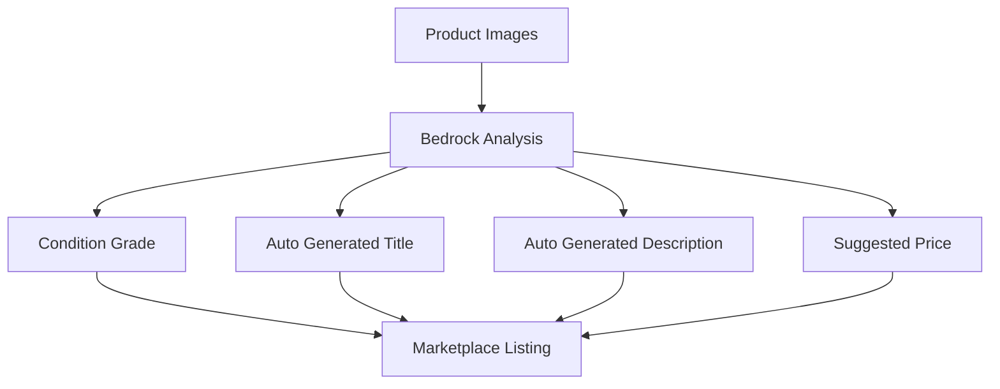
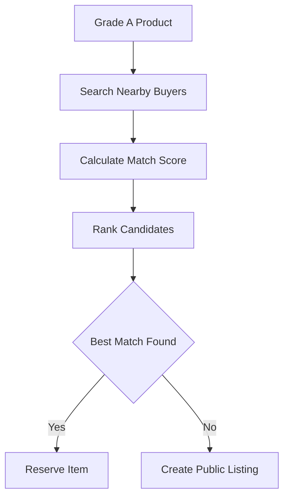
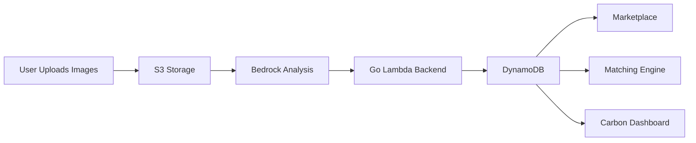
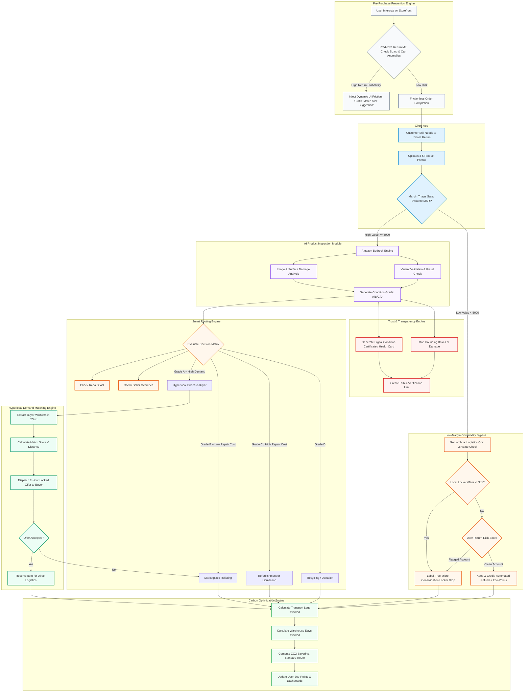

# AWS System Architecture & Diagrams

## 1. Simplified AWS Architecture Service Map

The SecondLife Commerce platform is built on a simplified, highly cost-effective serverless architecture designed for rapid deployment in a hackathon setting. It uses a Go monolithic backend running on AWS Lambda with Function URLs, storing structured data in Amazon DynamoDB, uploading media to Amazon S3, and utilizing Amazon Bedrock for AI-powered product inspection and grading.

| AWS Service | Role in Platform | Why We Chose It |
|-------------|------------------|-----------------|
| React + Tailwind | Customer App, Seller Dashboard, Operations Portal | Rapid UI development and responsive design |
| AWS Amplify | Frontend Hosting | CI/CD, global CDN, SSL, easy deployment |
| AWS Lambda (Go) | Backend Business Logic | Fully serverless, scales automatically, hackathon-friendly |
| Lambda Function URL | Public API Endpoint | Eliminates API Gateway setup overhead |
| Amazon DynamoDB | Primary Database | Fast NoSQL storage, flexible schema, serverless |
| Amazon S3 | Image & Document Storage | Product photos, inspection reports, certificates |
| Amazon Bedrock | AI Inspection & Intelligence | Product grading, damage analysis, listing generation |

---

## 2. Service Interaction Summary

```text
Customer / Seller App (React on Amplify)

        │
        ▼

AWS Lambda Function URL (Go Backend)

        ├──► Amazon DynamoDB
        │      Users
        │      Returns
        │      Listings
        │      Match Logs
        │
        ├──► Amazon S3
        │      Product Images
        │      Inspection Reports
        │
        └──► Amazon Bedrock
               Product Inspection
               AI Grading
               Listing Generation
```

---

# 3. Architecture Diagrams

## 3.1 High-Level Architecture



---

## 3.2 Detailed AWS Architecture



---

## 3.3 AI Inspection Workflow



---

## 3.4 Smart Routing Workflow



---

## 3.5 Direct-to-Next-Owner Workflow



---

## 3.6 Marketplace Listing Generation Workflow



---

## 3.7 Hyperlocal Matching Engine



---

## 3.8 Data Flow Diagram



---

## 3.9 End-to-End Product Lifecycle



---

## 4. DynamoDB Data Model

```text
Users
 ├── user_id (PK)
 ├── profile
 ├── role
 └── location

Products
 ├── product_id (PK)
 ├── owner_id
 ├── category
 └── status

Returns
 ├── return_id (PK)
 ├── product_id
 ├── inspection_id
 └── routing_status

Inspections
 ├── inspection_id (PK)
 ├── product_id
 ├── grade
 ├── damages
 └── confidence_score

Listings
 ├── listing_id (PK)
 ├── product_id
 ├── title
 ├── price
 └── status

CarbonMetrics
 ├── metric_id (PK)
 ├── product_id
 ├── co2_saved
 └── distance_saved
```

---

## 5. Request Lifecycle

```text
User Uploads Product Photos
        │
        ▼
Lambda Receives Request
        │
        ▼
Images Stored in S3
        │
        ▼
Bedrock Performs Inspection
        │
        ▼
Inspection Saved to DynamoDB
        │
        ▼
Routing Decision Generated
        │
        ▼
Match Buyer OR Create Listing
        │
        ▼
Carbon Impact Recorded
        │
        ▼
Response Returned to User
```