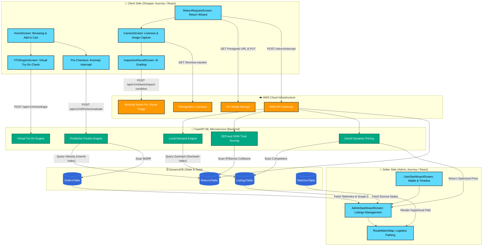

# SecondLife Commerce: Comprehensive End-to-End Architecture

This document provides an exhaustive, granular breakdown of the SecondLife Commerce ecosystem. It details every step of the lifecycle, explicitly defining how the Client (Shopper) interacts with the system, how the Seller (Admin) manages the recovery cycle, and how the ML Microservice and AWS DynamoDB orchestrate the heavy lifting securely.

---

## 🏗️ Detailed Architecture Flow Diagram

---

## 🛒 The Client Side (Detailed Shopper Journey)

The primary goal of the Client UI is to intercept problematic purchases before they happen, and drastically simplify the return process if a return is inevitable. It is composed of several React screens interacting with our ML Gateway.

### Phase 1: Pre-Checkout & Prevention
1. **Virtual Try-On (`VTOEngineScreen`):** 
   - A user browsing apparel takes a selfie.
   - The UI sends a Base64 image to the `Virtual Try-On Engine`. The AI simulates the drape and fit, actively preventing the user from buying the wrong size (the #1 cause of returns).
2. **Anomaly Interception (Pre-Checkout):**
   - As the user proceeds to checkout, the cart sends flat identifiers (`user_id`, `product_id`) to the `Predictive Friction Engine`.
   - The backend queries the **`ReturnsTable`** via `boto3`. If the user has a high historical return velocity (e.g., >3 returns this month) or is exhibiting bracketing behavior (adding sizes M and L to the same cart), dynamic UI friction is introduced. This restricts their "Green Credit" usage or forces an explicit confirmation prompt.

### Phase 2: The Return Wizard
1. **Liveness Verification (`CameraScreen`):**
   - If a return is initiated, the user must prove they possess the item. The camera UI calls **AWS Rekognition** to ensure the user is physically present, preventing automated return-fraud bots.
2. **Media Upload & Storage:**
   - The UI requests a presigned URL from the API Gateway and directly uploads the image to an **AWS S3 Bucket**, reducing server payload limits.
3. **AI Grading (`InspectionResultScreen`):**
   - The image is passed to **AWS Bedrock Nova Pro**. It performs visual damage assessment, identifying scratches or cracks, and returns specific SVG bounding box coordinates (`xmin`, `ymin`) to dynamically draw a heatmap over the product on the screen. The item is graded (e.g., Grade A, Grade B).
4. **Final Intercept & Routing (`ReturnRequestScreen`):**
   - The final submission hits `POST /return/intercept`. 
   - Before accepting, the **`SEFraud GNN Trust Scoring`** engine constructs an active graph using the `ReturnsTable`. If the user shares a `DeviceId` or `IPAddress` with a known bad actor, the return is flagged for manual review.
   - If clean, the **`Local Demand Engine`** hashes the user's GPS coordinates (`Geohash`) and queries the `ListingsTable` (`Geohash-index`) to find a matched local buyer instantly.

---

## 💼 The Seller Side (Detailed Admin Journey)

The Seller/Admin UI is focused on sustainability metrics, recovering capital from returned items, and monitoring local escrow logistics.

1. **Telemetry & Dashboard (`UserDashboardScreen` & `AdminDashboardScreen`):**
   - The admin UI aggregates data from the **`OrdersTable`** and **`MatchesTable`**.
   - It calculates the **Scope-3 Carbon Avoided** by bypassing traditional shipping, displaying this equivalent in "Trees Planted."
2. **Active Escrow Listings:**
   - Instead of rotting in a warehouse, the intercepted returned item is dynamically converted into an "Available" listing in the **`ListingsTable`**.
   - When the Local Demand Engine finds a buyer, the status changes to "Reserved" and the funds are held securely in Escrow. The admin UI displays these real-time state changes.
3. **Automated Markdown Management:**
   - Instead of manually repricing returned goods, the admin UI queries the **`GenAI Dynamic Pricing Engine`**.
   - The engine performs a real-time `boto3.scan()` on the `ListingsTable` for similar `product_id`s. 
   - It automatically calculates a customized discount rate combining: 
     * **Time Decay** (how long it's been listed)
     * **Demand Score** (current market interest)
     * **Competitor Matching** (undercutting identical local listings by 5%)
4. **Logistics Routing (`RouteMatrixMap`):**
   - Finally, the admin can view a graphical map overlay displaying the peer-to-peer route from the returner to the new buyer (or to a local Amazon Locker if a buyer wasn't found).

---

## 🔐 The Power of the Flat Payload

By refactoring the Client UI to only send flat IDs (`user_id`, `product_id`, `geohash`), we've eliminated major security vulnerabilities. 
* Previously, the React frontend calculated logic and passed massive mock arrays (`competitor_prices`, `user_history`) directly to the backend. This meant a malicious user could intercept the HTTP request and forge their own "perfect" history or "fake" competitor prices to manipulate the system.
* Now, the frontend is completely decoupled. The **FastAPI ML Microservice acts as the sole source of truth**, executing strict, authenticated `boto3` queries against DynamoDB to fetch the real data itself before running any algorithms.
