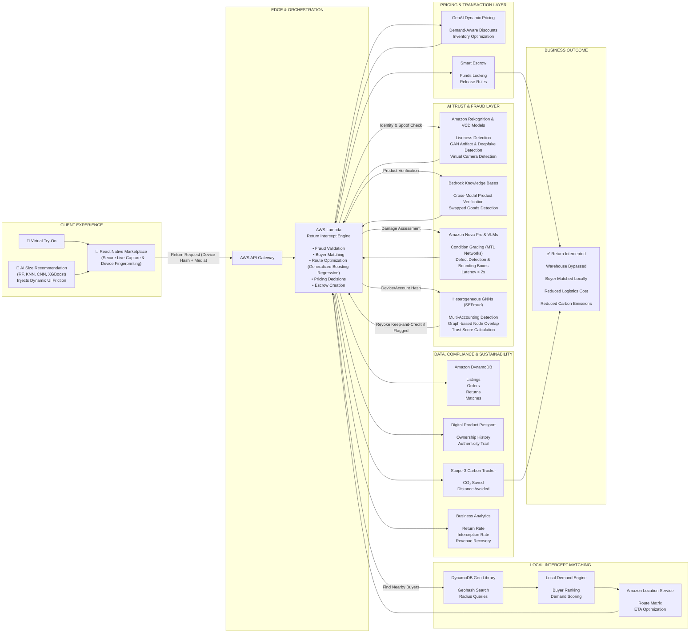

---

## 🏗️ System Architecture Flowchart

```mermaid
flowchart LR

%% =====================================================
%% CLIENT EXPERIENCE
%% =====================================================

subgraph CLIENT["CLIENT EXPERIENCE"]
    APP["📱 React Native Marketplace
    (Secure Live-Capture & Device Fingerprinting)"]
    VTO["👕 Virtual Try-On"]
    SIZE["📏 AI Size Recommendation
    (RF, KNN, CNN, XGBoost)
    Injects Dynamic UI Friction"]
end

VTO --> APP
SIZE --> APP

%% =====================================================
%% ORCHESTRATION
%% =====================================================

subgraph ORCHESTRATION["EDGE & ORCHESTRATION"]

    API["AWS API Gateway"]

    LAMBDA["AWS Lambda
Return Intercept Engine

• Fraud Validation
• Buyer Matching
• Route Optimization (Generalized Boosting Regression)
• Pricing Decisions
• Escrow Creation"]

end

APP -->|"Return Request (Device Hash + Media)"| API
API --> LAMBDA

%% =====================================================
%% TRUST & FRAUD
%% =====================================================

subgraph TRUST["AI TRUST & FRAUD LAYER"]

    REK["Amazon Rekognition & VCD Models

Liveness Detection
GAN Artifact & Deepfake Detection
Virtual Camera Detection"]

    EMB["Bedrock Knowledge Bases

Cross-Modal Product Verification
Swapped Goods Detection"]

    NOVA["Amazon Nova Pro & VLMs

Condition Grading (MTL Networks)
Defect Detection & Bounding Boxes
Latency < 2s"]

    GNN["Heterogeneous GNNs (SEFraud)
    
Multi-Accounting Detection
Graph-based Node Overlap
Trust Score Calculation"]

end

LAMBDA -->|"Identity & Spoof Check"| REK
LAMBDA -->|"Product Verification"| EMB
LAMBDA -->|"Damage Assessment"| NOVA
LAMBDA -->|"Device/Account Hash"| GNN

REK --> LAMBDA
EMB --> LAMBDA
NOVA --> LAMBDA
GNN -->|"Revoke Keep-and-Credit if Flagged"| LAMBDA

%% =====================================================
%% MATCHING ENGINE
%% =====================================================

subgraph MATCHING["LOCAL INTERCEPT MATCHING"]

    GEO["DynamoDB Geo Library

Geohash Search
Radius Queries"]

    ROUTE["Amazon Location Service

Route Matrix
ETA Optimization"]

    DEMAND["Local Demand Engine

Buyer Ranking
Demand Scoring"]

end

LAMBDA -->|"Find Nearby Buyers"| GEO
GEO --> DEMAND
DEMAND --> ROUTE
ROUTE --> LAMBDA

%% =====================================================
%% PRICING & FINANCE
%% =====================================================

subgraph FINANCE["PRICING & TRANSACTION LAYER"]

    PRICE["GenAI Dynamic Pricing

Demand-Aware Discounts
Inventory Optimization"]

    ESCROW["Smart Escrow

Funds Locking
Release Rules"]

end

LAMBDA --> PRICE
PRICE --> LAMBDA

LAMBDA --> ESCROW

%% =====================================================
%% DATA & COMPLIANCE
%% =====================================================

subgraph DATA["DATA, COMPLIANCE & SUSTAINABILITY"]

    DDB["Amazon DynamoDB

Listings
Orders
Returns
Matches"]

    DPP["Digital Product Passport

Ownership History
Authenticity Trail"]

    CO2["Scope-3 Carbon Tracker

CO₂ Saved
Distance Avoided"]

    ANALYTICS["Business Analytics

Return Rate
Interception Rate
Revenue Recovery"]

end

LAMBDA --> DDB
LAMBDA --> DPP
LAMBDA --> CO2
LAMBDA --> ANALYTICS

%% =====================================================
%% FINAL OUTCOME
%% =====================================================

subgraph OUTCOME["BUSINESS OUTCOME"]

    RESULT["✅ Return Intercepted

Warehouse Bypassed

Buyer Matched Locally

Reduced Logistics Cost

Reduced Carbon Emissions"]

end

ESCROW --> RESULT
CO2 --> RESULT
```

---
