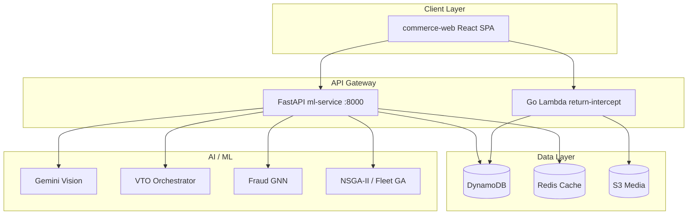

# Architecture

## System Overview

SecondLife Commerce is a **Circular Commerce and Return Interception Platform** that reduces reverse-logistics CO₂ by routing returned goods hyperlocally instead of shipping them to centralized warehouses.

## Clean Architecture Layers

| Layer | Location | Responsibility |
|-------|----------|----------------|
| Presentation | `frontend/src/views/`, `frontend/src/components/` | UI, routing, form state |
| Application | `backend/ml-service/main.py` routes | HTTP adapters, auth, validation |
| Domain | `*_engine.py`, `*_service.py` modules | Business rules, ML inference |
| Infrastructure | `boto3`, `gemini_ai_integrations.py`, SAM templates | AWS, external APIs |

## Design Principles

- **Stateless API**: JWT auth; no server-side sessions
- **Graceful degradation**: AI features return 503 or rule-based fallbacks when API keys absent
- **Single write path**: Listing state transitions go through DynamoDB state machine
- **Observability**: `X-Request-Id`, structured logging via `observability.py`

## Persona Routing

The SPA uses role-based tab routing (not separate deployables):

| Role | Primary flows |
|------|---------------|
| Buyer | Catalog → VTO → Cart friction → Return wizard → Triage |
| Seller | Listings → Escrow → Delivery tracking |
| Admin | Fraud → Serial verify → Fleet optimize → Inventory |

See [services/README.md](../services/README.md) for module-to-service mapping.
