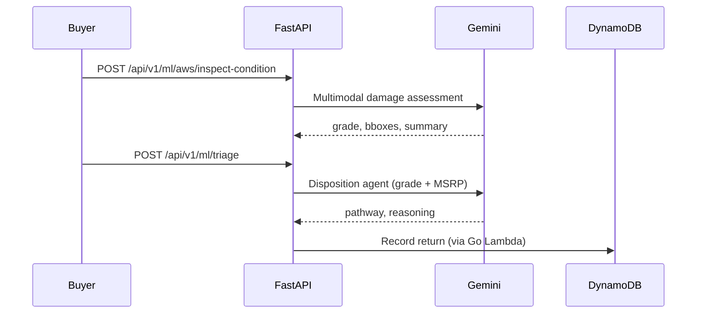

# ML Architecture

## Design Principles

1. **Feature engineering separated from inference** — each `*_engine.py` owns its domain logic
2. **No notebook code in production** — training scripts (`train_*.py`) are offline; inference loads artifacts or heuristics
3. **Modular providers** — `gemini_ai_integrations.py`, `aws_ai_integrations.py` isolate vendor APIs
4. **Graceful fallback** — rule-based engines when model artifacts or API keys are absent

## Model Inventory

| Module | Algorithm | Training | Inference | Data Source |
|--------|-----------|----------|-----------|-------------|
| `predictive_friction.py` | XGBoost + heuristics | `train_friction_model.py` | Checkout evaluate | ReturnsTable GSI |
| `dynamic_pricing.py` | Competitor scan + margin rules | N/A | Real-time price | ListingsTable scan |
| `demand_engine.py` | Geohash ranking | N/A | Buyer ranking | ListingsTable GSI |
| `network_fraud.py` | Graph features + rules | N/A | Trust score | Returns + Matches |
| `size_recommendation.py` | Random Forest | `train_size_model.py` | Size recommend | `size_dataset.csv` |
| `nsga2_routing.py` | NSGA-II multi-objective | N/A | Route Pareto front | Synthetic scenario |
| `fleet_optimizer.py` | Genetic algorithm | N/A | Fleet assignment | Synthetic scenario |
| `gemini_ai_integrations.py` | Gemini 3.5 Flash | Managed | Vision + disposition | User uploads |
| `vto_orchestrator.py` | IDM-VTON / local overlay | Pre-trained HF | Garment drape | Product registry |
| `serial_verification.py` | IDEFICS2 (HF) | Managed | OCR match | Package label image |

## Inference Pipeline: Return Triage



## Inference Pipeline: Virtual Try-On

```
Photo upload → vto_pose (body estimate) → vto_size_charts (fit) → idm_vton_client OR local overlay → vto-storage/
```

Controlled by `vto_orchestrator.py`. DynamoDB session persistence optional (`USE_DYNAMODB_VTO=1`).

## Artifact Management

| Artifact | Path | Status |
|----------|------|--------|
| `friction_model.json` | ml-service/ | Train via `train_friction_model.py` |
| `size_model.joblib` | ml-service/ | Train via `train_size_model.py` |
| `margin_predictor.onnx` | serverless-api | Referenced in Go; formula fallback active |

Artifacts are **gitignored**; CI should build and publish to S3 model registry.

## API Key Requirements

| Feature | Env var | Behavior without key |
|---------|---------|------------------------|
| Condition grading | GEMINI_API_KEY | Rule-based mock in gemini module |
| Video inspect | GEMINI_API_KEY | HTTP 503 |
| Disposition agent | GEMINI_API_KEY | Rule-based pathway |
| Face liveness | AWS creds | Mock session ID |
| Serial OCR | HF_API_KEY | Heuristic OCR simulation |

## Scaling Recommendations

- VTO → GPU ECS service with request queue (SQS)
- Fraud GNN → Neptune + batch feature extraction
- Friction model → SageMaker endpoint with auto-scaling
- Gemini calls → circuit breaker + cached assessments per image hash
